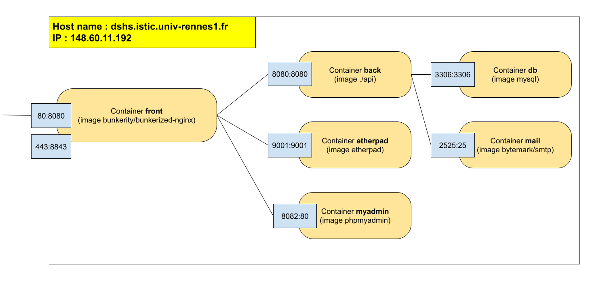

# Remote meetings planning

This project is used in a course on the *ops* part at the [University of Rennes](https://www.univ-rennes1.fr/), France. It is a kind of doodle clone developed in so-called "native cloud" technologies in order to allow students to work on a continuous deployment chain in a containerized environment. Among the feature, the application automatically initializes a pad for the meeting and a chat room for the meeting participants.

- The [back](https://github.com/barais/doodlestudent/tree/main/api) is developed using the [quarkus.io](https://quarkus.io/) framework. 
- The [front](https://github.com/barais/doodlestudent/tree/main/front) is developed in [angular](https://angular.io/) using the [primeng](https://www.primefaces.org/primeng/)  angular UI component library and the [fullcalendar](https://fullcalendar.io/) graphical component.

A demo of the application is available [here](https://doodle.diverse-team.fr/).

Three videos (in french) are available. They present:
- the [main application feature](https://drive.google.com/file/d/1GQbdgq2CHcddTlcoHqM5Zc8Dw5o_eeLg/preview), 
- its [architecture](https://drive.google.com/file/d/1l5UAsU5_q-oshwEW6edZ4UvQjN3-tzwi/preview) 
- and a [short code review](https://drive.google.com/file/d/1jxYNfJdtd4r_pDbOthra360ei8Z17tX_/preview) .

For french native speaker that wants to follow the course. The course web page is available [here](https://hackmd.diverse-team.fr/s/SJqu5DjSD).

## Binômes:

- Soufiane DERMOUMI
- Said HADIM

**Tâches faites :**

- [x] Tâche 0
- [x] Tâche 1
- [x] Tâche 2
- [x] Tâche 3
- [x] Tâche 4


### Tâche 0

Notre machine virtuelle a comme adresse IP : **148.60.11.192**, et des ports ouverts : **80** et **443**
Nous avons demandé un sous-domaine **hsds.reverse-team.fr** mais malhereusement ça n'a pas été réservé 🤷‍♂️.

### Tâche 1

nous utilisons un seul fichier docker-compose qui se trouve à la racine du répertoire pour lancer l'ensemble de notre application, avec un fichier DockerFile `./api/Dockerfile` pour faire tourner le back et un fichier DockerFile `./front/Dockerfile` pour le front de l'application.


### Tâches 2 et 3

On utilise une image bunkerity/bunkerized-nginx pour le front de l'application, cette image offre la possibilité de configurer la redirection sur les différents services de l’application.  
A cette étape on notera qu’il y a eu des problèmes avec la récupération des certificats let's encrypt pour des raisons de permissions 😭 :   
```
front_1     | Saving debug log to /var/log/letsencrypt/letsencrypt.log
front_1     | The following error was encountered:
front_1     | [Errno 13] Permission denied: '/etc/letsencrypt/.certbot.lock'
front_1     | Either run as root, or set --config-dir, --work-dir, and --logs-dir to writeable paths.
```
et aussi vu que notre sous domaine n'était pas attribué, la redirection sur les services pad, phpmyadmin, ... ne fonctionne pas comme il faut.

### Tâche 4

À cette étape, l’application est déployée de cette façon.

